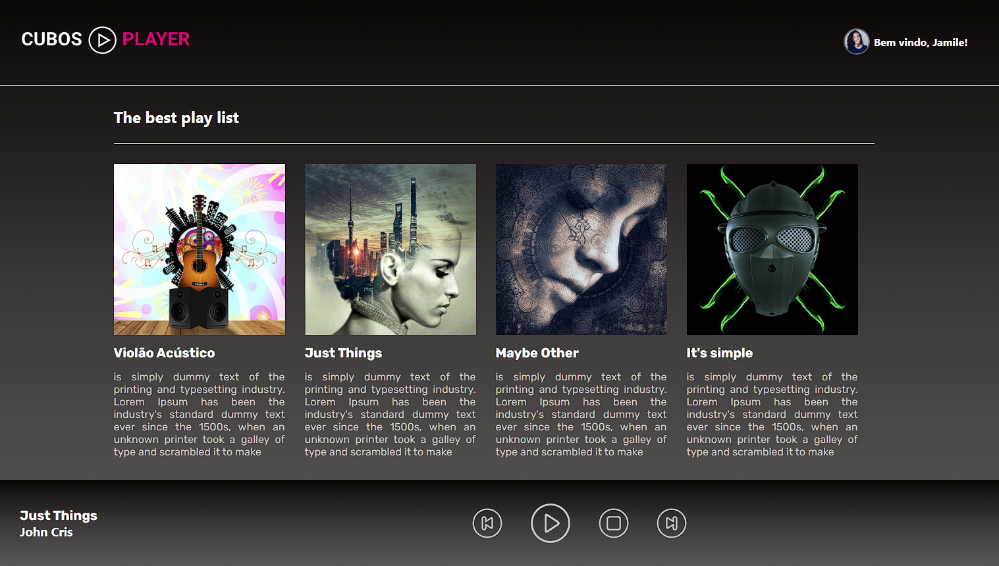

# Desafio de React - Cubos Player

O desafio consistia em desenvolver um player de música utilizando React. Para isso foi necessário usar o layout figma disponibilizado pela Cubos.

### Exemplo:

---
### Requisitos obrigatórios:

- Quando clicar na imagem de uma música, a música deve ser iniciada;
- Deve mostrar no player o nome e o artista da música que está tocando;
- Se pressionar no botão de pause, a música deve parar;
- Se pressionar novamente no botão de pause, a música deve continuar;
- Se pressionar o botão de avançar, trocar para a próxima música;
- Se pressionar o botão de retroceder, trocar para a música anterior;
- Se pressionar o botão de parar, parar de tocar a música;
- Fazer o layout o mais fiel possível com a proposta do figma, porém, você pode fazer alguns ajustes pessoais se quiser, para deixar o projeto mais com sua cara.

---

### Requisitos opcionais
- Calcular e mostrar o tempo restante da música de acordo com a música que está tocando;
- Fazer a barra de progresso da música;
- Se pressionar o botão de avançar e segurar, avançar no tempo da música;
- Se pressionar o botão de retroceder e segurar, retroceder no tempo da música.

---

### Meu projeto:

### Processo do projeto:

Durante a elaboração do projeto foram utilizado os seguintes processos:

- Criação e manipulação de estado;
- Criação e manipulação de referências;
- Utilização de eventos de clique;
- Passar propriedades;
- Importar imagens;
- Execução de uma ação várias vezes de tempo em tempo;
- Importar dados do arquivo json;
- Procurar itens.

###### tags: `módulo 3` `front-end` `React`

